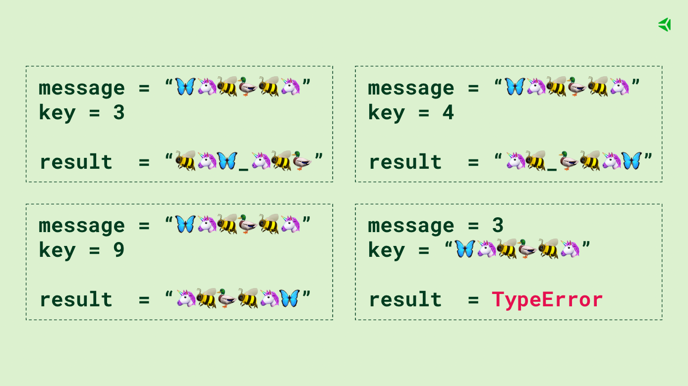

# 🚀 Projeto: Algorithms

## ℹ️ Sobre o Projeto

No projeto Algorithms, eu tive a oportunidade de desenvolver sua lógica de programação e habilidades de resolução de problemas, implementando algoritmos para resolver diferentes desafios.

## 📷 Exemplo da criptografia

## 🛠️ Tecnologias e Habilidades

- **Linguagem Utilizada:** Python 3.10.6
- **Habilidades Exercitadas:** Lógica, Interpretação de Problemas, Otimização de Algoritmos, Resolução de Problemas Sob Pressão

## 📋 Funcionalidades Implementadas

### 01 - Número de Estudantes Estudando no Mesmo Horário (Algoritmo de Busca)

- Implementação de uma função para determinar o melhor horário para disponibilizar conteúdos de estudo com base no número de estudantes acessando a plataforma em diferentes horários.

### 02 - Criptografia de Inversões (Testes)

- Desenvolvimento de testes para garantir o funcionamento correto de uma função de criptografia que realiza inversões em uma mensagem de acordo com uma lógica específica.

### 03 - Palíndromos (Recursividade)

- Implementação de uma função para verificar se uma palavra é um palíndromo, ou seja, se ela mantém o mesmo sentido quando lida de trás para frente.

### 04 - Anagramas (Algoritmo de Ordenação)

- Desenvolvimento de um algoritmo para comparar duas strings, ordená-las e identificar se uma é um anagrama da outra, considerando letras maiúsculas e minúsculas como iguais durante a comparação.

## 🔍 Como Editar ou Copiar o Projeto

1. Faça um fork deste repositório para sua conta do GitHub.
2. Clone o fork para sua máquina local usando o comando:
git clone https://github.com/seu_usuario/nome_do_projeto.git

